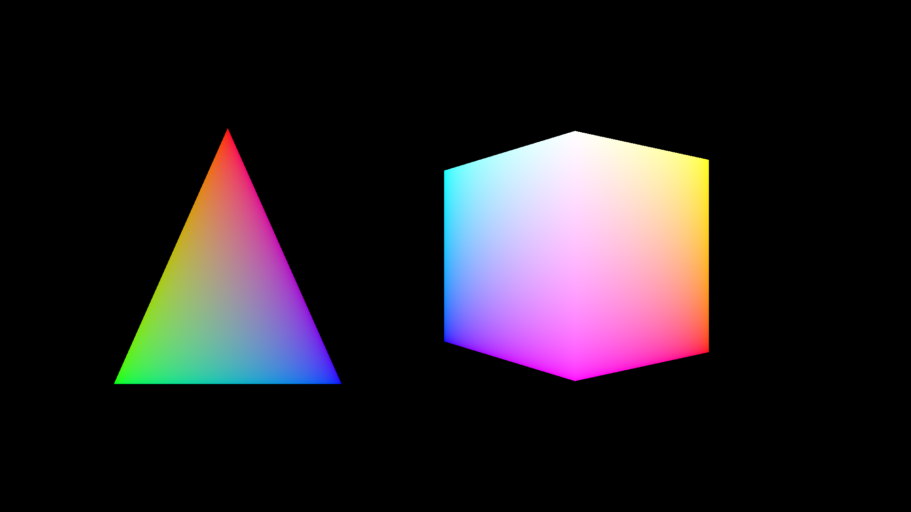

A fairly simple vulkan base for me to start projects with. May or may not be useful for you. Handles things like syncronisation, window resizing and a depth buffer.

Based on the [erupt](https://crates.io/crates/erupt) [triangle example](https://gitlab.com/Friz64/erupt/-/blob/master/erupt_examples/src/bin/triangle.rs).
